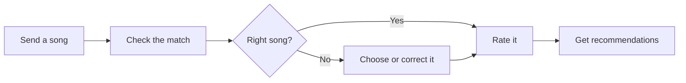
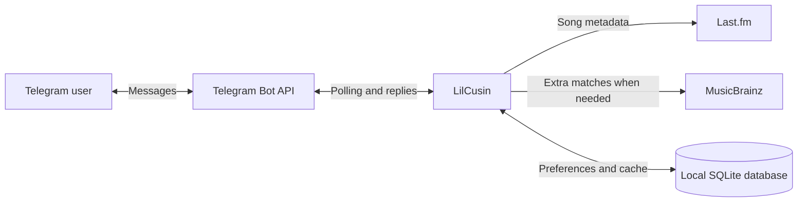

# LilCusin 🎵

A Telegram bot that learns what music you like. Send it a song, rate the match,
and ask for recommendations.

> Try sending `Radiohead - Creep` in a private chat. You can also send or forward
> Telegram audio that has an artist and title.

## What happens when you send a song



The bot looks up song **metadata** (artist and title). It does not listen to or
download the audio. Ratings are ❤️ Love, 👍 Like, 😐 Neutral, and 👎 Dislike.
Use **For You** for a list based on your taste, or **More Like This** to start
from one song.

## Run your own bot

You need Python 3.12+, a [Telegram bot token from @BotFather](https://t.me/BotFather),
and a [Last.fm API key](https://www.last.fm/api/account/create). Your computer
or server must be able to reach the APIs described in [Network access](#network-access).

1. **Install the Python packages.** From this repository's folder:

   ```bash
   python -m venv .venv
   ```

   Activate the environment, then install:

   | System | Activate with |
   | --- | --- |
   | macOS / Linux | `source .venv/bin/activate` |
   | Windows PowerShell | `.venv\Scripts\Activate.ps1` |

   ```bash
   python -m pip install -r requirements.txt
   ```

2. **Create your private configuration file.** Copy `.env.example` to `.env`,
   then open `.env` and fill in the empty values. On macOS/Linux, use
   `cp .env.example .env`; on Windows PowerShell, use
   `Copy-Item .env.example .env`.

   | Setting | Put this in `.env` |
   | --- | --- |
   | `TELEGRAM_BOT_TOKEN` | The token from BotFather |
   | `LASTFM_API_KEY` | Your Last.fm API key |
   | `TELEGRAM_API_BASE_URL` | `https://api.telegram.org` if reachable, or the HTTPS origin of your trusted Telegram relay |
   | `LIL_BRO_BOT_USERNAME` | Optional username for the related bot; leave the example value unless you use a different bot |

3. **Start the bot.**

   ```bash
   python -m music_bot
   ```

Open your bot in Telegram and send `/start`. Keep the process running to receive
messages. LilCusin uses **polling**, so it needs no public inbound port. Run only
one copy for a bot token, and do not set a webhook for the same bot. If the bot
already runs on a VPS, stop that copy before starting another one.

> **Keep secrets private:** `.env` and the local database are ignored by Git.
> Never commit, screenshot, or paste real tokens, API keys, or user data. If a
> secret was ever committed, rotate it; deleting a file does not erase Git history.

## What can I do in Telegram?

| Action | What happens |
| --- | --- |
| Send `Artist - Song title` or Telegram audio | The bot searches for the song and asks you to confirm uncertain matches. |
| Rate a confirmed song | Love and Like teach **For You** your preferences. You can change a rating later. |
| Tap **More Like This** | Find songs related to the selected song, even before rating it. |
| `/taste` or `/profile` | See your taste summary or rating counts. |
| `/connectchannel` | Optionally connect a playlist channel; new audio posts can become weak taste signals after identification. |
| `/privacy` or `/forgetme` | Read what is stored or remove your personal records. |

If a match is wrong, choose another candidate or reply to the correction prompt
with `Artist - Song title`. `/cancel` closes an unfinished search. The match is
based on metadata and can be wrong even when the names look similar.

## Technical details

### Where requests and data go



`TELEGRAM_API_BASE_URL` changes only the **Telegram Bot API** origin. It must be
an HTTPS origin such as `https://api.telegram.org`, with no path, query, or
credentials. A trusted relay can be used when Telegram is blocked on the host.

### Network access

The current repository calls Last.fm and MusicBrainz at their normal URLs.
Changing `TELEGRAM_API_BASE_URL` does **not** route those two services. If your
server cannot reach them, their provider clients need a separate relay or other
network route. The bot's song lookup and enrichment depend on those services;
Telegram connectivity alone is not enough.

### Data and privacy

The bot creates `data/music_bot.sqlite3` when it starts. It stores Telegram user
IDs and basic profile fields, song submissions and file identifiers, ratings,
recommendation history, provider metadata, and short-lived button state. The
optional channel feature also stores channel and new-post identifiers. Audio
files are not downloaded, and old channel history is not imported.

`/forgetme` removes the requesting user's profile and related personal records.
Shared song metadata can remain for other users; messages already held by
Telegram and provider-side records are outside this deletion. Read `/privacy`
in the bot for the full in-app explanation. See [SECURITY.md](SECURITY.md) for
reporting and local-data guidance.

### Playlist channels

To connect a channel, send `/connectchannel` privately, make the bot a channel
administrator, and post the one-time code as a **new text post** in that channel.
You must also be its creator or an administrator. Leave optional permissions
such as posting, editing, deleting, and inviting disabled; the bot does not
post there. Only eligible **future** audio posts are processed. Uncertain songs
wait for private review in `/channels`. A channel post is a weak signal, not a
claim that you listened to or liked the song.

### Code map

| Area | Where to look |
| --- | --- |
| Startup and polling | `music_bot/__main__.py` |
| Configuration | `music_bot/config.py`, `.env.example` |
| Song matching | `music_bot/workflow.py`, `music_bot/matching.py` |
| Last.fm and MusicBrainz clients | `music_bot/providers/` |
| Recommendations | `music_bot/recommendations/` |
| Data storage | `music_bot/database.py`, `music_bot/models.py` |
| Tests | `tests/` |

### Tests and live checks

Run the automated tests after installing `requirements.txt`:

```bash
python -m unittest discover -v
python -m compileall -q music_bot tests
```

To check the **real** Last.fm and MusicBrainz APIs, run
`python -m music_bot.validate_sources`. This uses your Last.fm key and makes
external requests, but sends no Telegram messages. Do not run multiple live
validators at once.

### Limits and project status

Identification is not acoustic recognition. Provider coverage and spelling
affect results, including songs written in Persian. Recommendations are
heuristics, not a guarantee that someone will like a song. This is a self-hosted
project with no hosted-service uptime promise. No license is currently included;
reuse permissions have not been specified.
